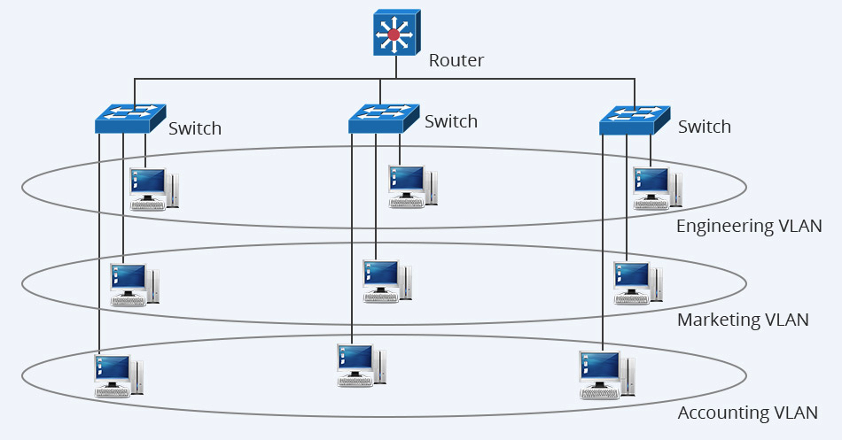
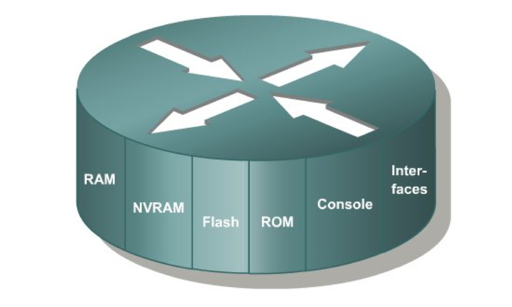
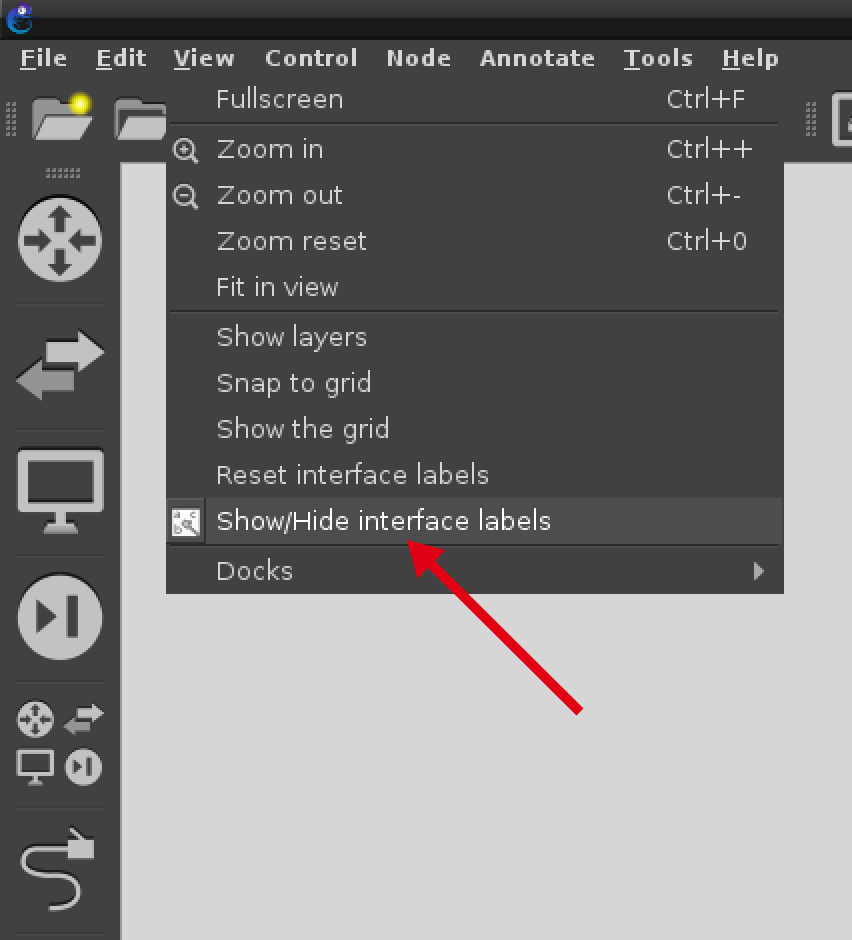

# LABORATÓRIO REDES VIRTUAIS

Em Redes de Computadores conforme aumenta sua complexidade, demanda de usuários e quantidade de equipamentos interconetados, problemáticas incipientes tornam-se um fator de preocupação, transformando a rede em um ambiente desforável a produtividade necessária do usuário.

O aumento escalar de uma rede impacta diretamente no aumento de colisão, envio de <i>broadcast</i>, bem como uma insegurança no ambiente, considerando que todos os departamento de uma empresa ou órgão encontram-se inteconectados na mesma redes. Para sanar estes problemas Virtual Lan (VLAN) são criadas, nos quais implementam-se no switch uma segmentação lógica na rede, mapeando as portas dos dispositivos dentro do segmento ao qual necessita-se fazer seu agrupamento, como por setor de uma empresa: Recurso Humanos, Contabilidade, Adminstrativo, etc. A Figura 01 apresenta um exemplo de rede com vlan no qual equipamentos em switchs distintos fazem parte da mesma vlan.

<h4 align="middle">Figura 01 - Virtual Lan (VLAN)</h4>

No laboratório será criado um ambiente similar ao apresentado na Figura 01, para isso iremos utilizar o Software de Simulação de Rede para equipamentos da CISCO <a href="https://www.gns3.com/">GNS3</a>, vale ressaltar que o GNS3 possui suporte para executar de Container Docker, no qual será utilizado um Container com Debian. Preparei um Appliance que já vem com as imagens do IOS (Sistema Operacional CISCO), bem como o GNS3 instalado no link abaixo:

[Appliance GNS3](https://drive.google.com/open?id=1F8LG6MlVq109AkOACGeWDzx50pdhm2w2) 

O usuário padrão para login na interface gráfica do sistema é <b>gns3</b> e a senha tanto deste usuário quanto do <b>root</b> é  <b>123456</b>

<h3 align="left">1 - Entendo a Arquitetura dos Equipamentos da CISCO</h3>

Um roteador e um switch é um compador com função específica de interconectar redes, seu hardware funciona de uma maneira um pouco difererente de um computador pessoal, no qual nosso laboratório estará orientado, a Figura 02, apresenta a arquitetura dos componentes principais de um roteador. 

<h4 align="middle">Figura 02 - Componentes Roteador</h4>

*  <b>RAM</b> – Armazena as tabelas de roteamento e o arquivo de configuração temporário do roteador;

* <b>NVRAM</b> – Armazena o arquivo de configuração que será utilizado na inicialização (startup config), não ocorre perca das informações armazenadas na NVRAM ao desligar o roteador;

* <b>FLASH</b> - Armazena a imagem de inicialização do Sistema Operacional, possui a possibilidade armazenar várias imagens, retém seu conteúdo quando o roteador é desligado;

* <b>ROM</b> -  Mantém instruções que definem o autoteste realizado na inicialização do roteador;

* <b>Console</b> -  É uma interface de acesso direto ao roteador para sua manutenção e atualização de firmware em caso de percado de acesso externo;

* <b>Interfaces</b> -  Conectam o roteador à rede para entrada e saída de pacotes, podem estar diretamenta conectadas na placa-mãe ou adicinadas através de módulos, em computadores pessoas são chamadas de placas de rede;

Todas as configurações realizadas em um roteador são salvas na RAM, portanto é um dado volátil, ocorrendo o desligamento inesperado a configuração feita é <b>PERDIDA</b>, daí a necessidade de salvar constante o que foi realizado na NVRAM através do comando: <i>copy running-config startup-config</i>.

<h3 align="left">2 - Preparando o Ambiente para Realizar o Laboratório</h3>

O ambiente de simulação proposto contará com 3 (três) switchs, 03 (três) vlans, 06 (seis) Container Debian e um Router que irá fazer a comunicação entre as vlans, a Figura 03, apresenta a arquitetura deste ambiente com nome de vlans, enderaçamento de interfaces e portas a serem usadas, é importante pontuar que ao criar este ambiente no GNS3 deve-se seguir rigorosamenete as portas apresentadas na imagem.

<h4 align="middle">Figura 03 - Laboratório vlan</h4>

Para melhor visualização habilite a visualização das portas dos equipamentos, conforme apresentado na Figura 04, Menu View => Show/Hide interface labes.

<h4 align="middle">Figura 04 - Habilitar Visualização de Portas</h4>

É um curso gratuíto de 10 horas, que não tem obrigatoriedade de sua realização, mas já disponibiliza conteúdo e a o download da ferramenta. O mais importante é que você pode até achar o arquivo de instalação do Packet Tracer na internert, todavia para liberar todas as funcionalidades da ferramenta é necessário um login criado no cadastro deste curso, vou disponiblizar a seguir o arquivo para download direto que salvei no google drive:

[Packet Tracer - 32 bits](https://drive.google.com/open?id=10PJHweyAjtvTW5J4JWVAGVdsNSeJKk9f)

[Packet Tracer - 64 bits](https://drive.google.com/open?id=1v3oJeTjKZX5XFH3iwGnDYITVQ1u1FQG_)

[Packet Tracer - Linux](https://drive.google.com/open?id=10dGsuiEm2PqPYw1F5qqx2Pkdquy4sOBQ)

Após o download faça a instalação do aplicativo que é muito simples, realize o login no mesmo, é o usuário que você cadastrou para ter acesso ao curso, e faça o download do arquivo do laboratório disponiblizado abaixo:

[Laboratório - Roteamento Dinâmico RIP](https://drive.google.com/open?id=1H6cVuwK_GAYC0BXm2RTWAelJVvFJ1O6D)

Menu Options => Preferences
 
<h3 align="left">5.3 - Execução do Laboratório</h3>

Ao abrir o arquivo baixado no link acima, o Packet Tracer será aberto com duas telas, uma com o wizard que apresentará seus acerto no final e a outra com o diagrama de rede no qual você irá configurar, Figura4. 

<h4 align="middle">Figura 04 - Laboratório Packet Tracer</h4>

Objetivo do Laboratório:

*  Congigurar o endereçamento IP em todos os dispositivos do ambiente;

* Configurar o Roteamento Dinâmico RIP no <b>Router1</b> e <b>Router2</b> para que o <b>PC0</b> possa se comunicar com o <b>PC1</b>;

