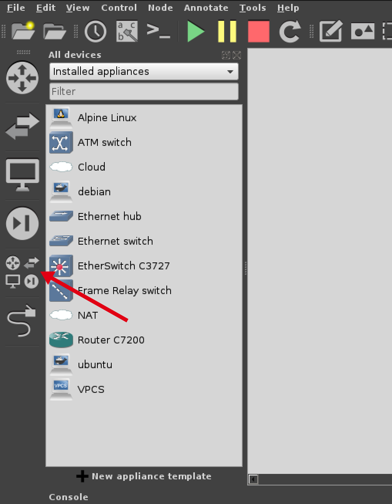
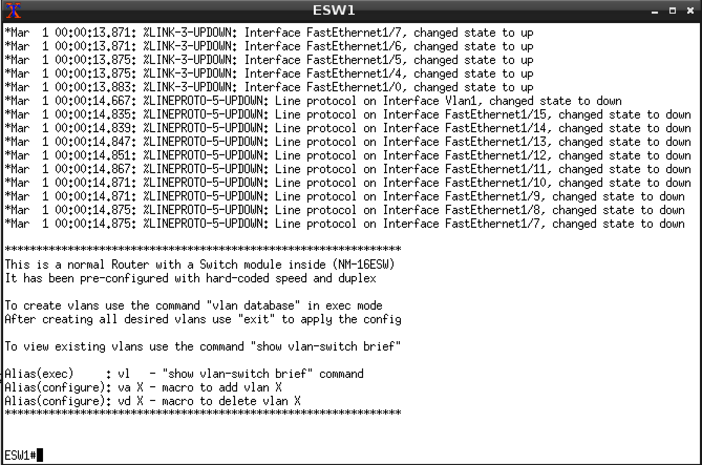
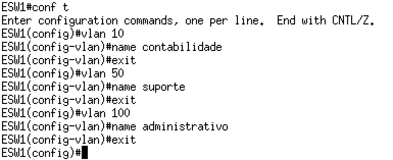
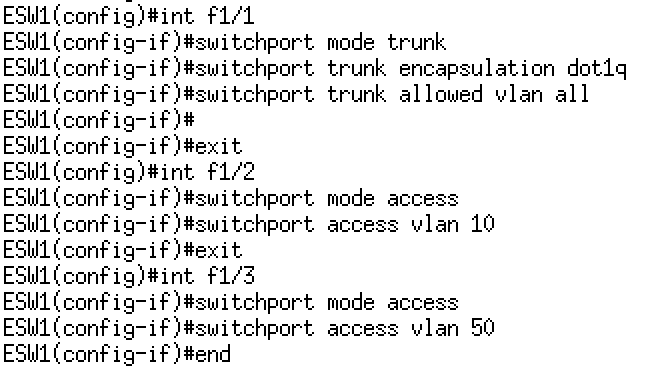
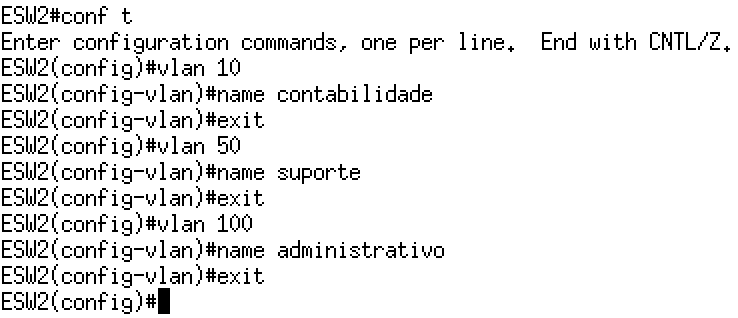
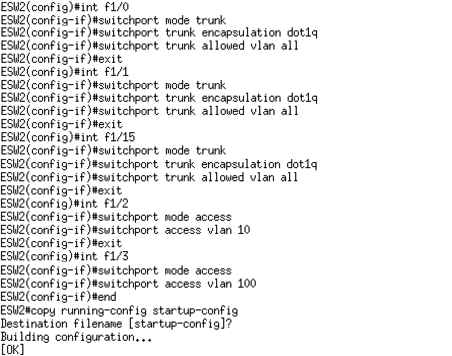
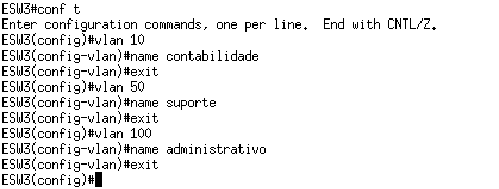
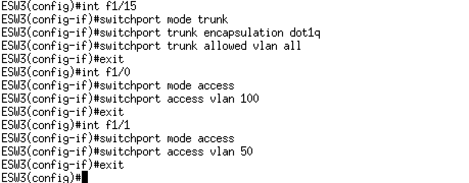
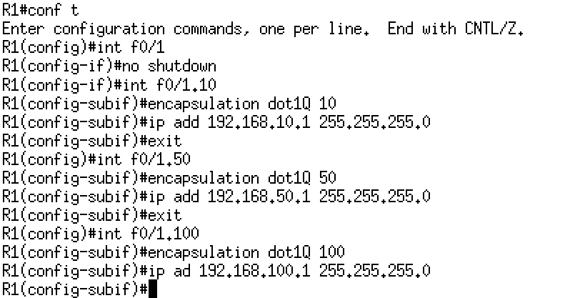

# LABORATÓRIO REDES VIRTUAIS

Em Redes de Computadores conforme aumenta sua complexidade, demanda de usuários e quantidade de equipamentos interconetados, problemáticas incipientes tornam-se um fator de preocupação, transformando a rede em um ambiente desforável a produtividade necessária do usuário.

O aumento escalar de uma rede impacta diretamente no aumento de colisão, envio de <i>broadcast</i>, bem como uma insegurança no ambiente, considerando que todos os departamento de uma empresa ou órgão encontram-se inteconectados na mesma redes. Para sanar estes problemas Virtual Lan (VLAN) são criadas, nos quais implementam-se no switch uma segmentação lógica na rede, mapeando as portas dos dispositivos dentro do segmento ao qual necessita-se fazer seu agrupamento, como por setor de uma empresa: Recurso Humanos, Contabilidade, Adminstrativo, etc. A Figura 01 apresenta um exemplo de rede com vlan no qual equipamentos em switchs distintos fazem parte da mesma vlan.

<h4 align="middle">Figura 01 - Virtual Lan (VLAN)</h4>

No laboratório será criado um ambiente similar ao apresentado na Figura 01, para isso iremos utilizar o Software de Simulação de Rede para equipamentos da CISCO <a href="https://www.gns3.com/">GNS3</a>, vale ressaltar que o GNS3 possui suporte para executar de Container Docker, no qual será utilizado um Container com Debian. Preparei um Appliance que já vem com as imagens do IOS (Sistema Operacional CISCO), bem como o GNS3 instalado no link abaixo:

[Appliance GNS3](https://drive.google.com/open?id=1F8LG6MlVq109AkOACGeWDzx50pdhm2w2) 

O usuário padrão para login na interface gráfica do sistema é <b>gns3</b> e a senha tanto deste usuário quanto do <b>root</b> é  <b>123456</b>

<h3 align="left">1 - Entendo a Arquitetura dos Equipamentos da CISCO</h3>

Um roteador e um switch é um compador com função específica de interconectar redes, seu hardware funciona de uma maneira um pouco difererente de um computador pessoal, no qual nosso laboratório estará orientado, a Figura 02, apresenta a arquitetura dos componentes principais de um roteador. 

<h4 align="middle">Figura 02 - Componentes Roteador</h4>

*  <b>RAM</b> – Armazena as tabelas de roteamento e o arquivo de configuração temporário do roteador;

* <b>NVRAM</b> – Armazena o arquivo de configuração que será utilizado na inicialização (startup config), não ocorre perca das informações armazenadas na NVRAM ao desligar o roteador;

* <b>FLASH</b> - Armazena a imagem de inicialização do Sistema Operacional, possui a possibilidade armazenar várias imagens, retém seu conteúdo quando o roteador é desligado;

* <b>ROM</b> -  Mantém instruções que definem o autoteste realizado na inicialização do roteador;

* <b>Console</b> -  É uma interface de acesso direto ao roteador para sua manutenção e atualização de firmware em caso de percado de acesso externo;

* <b>Interfaces</b> -  Conectam o roteador à rede para entrada e saída de pacotes, podem estar diretamenta conectadas na placa-mãe ou adicinadas através de módulos, em computadores pessoas são chamadas de placas de rede;

Todas as configurações realizadas em um roteador são salvas na RAM, portanto é um dado volátil, ocorrendo o desligamento inesperado a configuração feita é <b>PERDIDA</b>, daí a necessidade de salvar constante o que foi realizado na NVRAM através do comando: <i>copy running-config startup-config</i>.

<h3 align="left">2 - Preparando o Ambiente para Realizar o Laboratório</h3>

O ambiente de simulação proposto contará com 3 (três) switchs, 03 (três) vlans, 06 (seis) Container Debian e um Router que irá fazer a comunicação entre as vlans, a Figura 03, apresenta a arquitetura deste ambiente com nome de vlans, enderaçamento de interfaces e portas a serem usadas, é importante pontuar que ao criar este ambiente no GNS3 deve-se seguir rigorosamenete as portas apresentadas na imagem.

<h4 align="middle">Figura 03 - Laboratório vlan</h4>

Para melhor visualização habilite a visualização das portas dos equipamentos, conforme apresentado na Figura 04, Menu View => Show/Hide interface labes.

<h4 align="middle">Figura 04 - Habilitar Visualização de Portas</h4>

Os dispositivos de rede são adicinados pelo botão <b>Browse all devices</b>, apontado pela seta na Figura 5, clique e arraste os dispositivos para área de configuração, neste laboratório foram utilizados como Switch o <b>EtherSwitch c3727</b>, como Roteador o <b>Router C7200</b> e como cliente o <b>Container Debian</b>

<h4 align="middle">Figura 05 - Habilitar Visualização de Portas</h4>

<b>Lembre-se de deixar seu laboratório identico ao da Figura 03</b>

É um curso gratuíto de 10 horas, que não tem obrigatoriedade de sua realização, mas já disponibiliza conteúdo e a o download da ferramenta. O mais importante é que você pode até achar o arquivo de instalação do Packet Tracer na internert, todavia para liberar todas as funcionalidades da ferramenta é necessário um login criado no cadastro deste curso, vou disponiblizar a seguir o arquivo para download direto que salvei no google drive:

<h3 align="left">3 - Execução do Laboratório</h3>

Conforme abordado no Item 1, o arquivo temporário de configuração de um roteador fica localizado na RAM, toda configuração que está sendo digitada e feita durante o laboratório encontra-se na RAM, salva em um arquivo chamado <b>running-config</b>, caso ocorra um desligamento do router ou switch, toda a configuração será perdida. 

Para que a configuração feita não se perca, deve-se salvar seu conteúdo na NVRAM em um arquivo chamado <b>startup-config</b>, no qual a cada inicialização do Sistema Operacional (SO), esta configuração é carregada. O procedimento para salvar o conteúdo da RAM na NVRAM é através do comando <b>copy running-config startup-config</b>, devendo ser executado no prompt privilegiado.

Será seguida a seguinte sequência de configuração dos equipamentos:

1. Configuração dos Switchs;
2. Configuração dos Clientes Debian; e,
3. Configuração do Router.

Em algumas situações esta ordem não será seguida no roteiro, todavia será explicitado ao longo deste manual

<h3 align="left">3.1 - Configuração dos Switchs</h3>

As configurações necessárias para implentação de VLAN neste ambiente é a criação da vlan, e o modo como as portas estarão operado:

* Modo Trunk - Quando na porta existe a necessidade de trafegar pacotes de mais de uma vlan;
* Modo Access - Quando na porta está trafegando <b>exclusivamente</b> pacotes de somente uma vlan.

<h3 align="left">3.1.1 - Configuração dos Switch ESW1</h3>

Após concluir a configuração do desenho do ambiente, e linkar todos os dispositivos, inicialize os equipamentos com o botão Start (localizado logo abaixo do menu <b>Annotate</b>), ao dar dois cliques em cima do desenho do Switch ESW1 será aberto o prompt de configuração, e carregado o SO do equipamento conforme Figura 06.

<h4 align="middle">Figura 06 - Prompt Switch</h4>

<h2 align="middle">Criando Vlan - ESW1</h2>

Acesse o prompt de configuração com o comando <b>conf t</b>, acesse o prompt de configuração da vlan com o comando <b>vlan 10</b>, atribua o nome da vlan com o comando <b>name contabilidade</b>, por fim saia do prompt da interface com o comando <b>exit</b>, repita o procedimento para criar as outras 03 (três) vlans conforme apresentado na Figura 07: 

<h4 align="middle">Figura 07 - Configuração vlan ESW1</h4>

<h2 align="middle">Inclusão das Interfaçes na Vlan - ESW1</h2>

Para inclusão das interfaces nas vlans configuradas deve-se acessar individualmente o prompt das interfaces e configurar em modo acesso (para interfaces que fazem para de somente uma vlan) ou modo trunk (interfaces que transmitem tráfego de várias vlans). Em nosso laboratório a interface do switch ESW1 f1/1 deve ser configurada em modo trunk, a interface f1/2 em modo acesso para a vlan 10 e interface f1/3 em modo acesso para a vlan 50, conforme apresentado na Figura 08.

<h4 align="middle">Figura 08 - Inclusão de Interfaces na Vlan - ESW1</h4>

Para salvar as configurações realizadas digite o comando <b>copy running-config startup-config</b>

<h3 align="left">3.1.2 - Configuração dos Switch ESW2</h3>

Não entrarei em muitos detalhes quanto o comandos de configuração, considerando que já expliquei todos durante a configuração do Switch ESW1.

<h2 align="middle">Criando Vlan - ESW2</h2>

Em todos os switchs deve-se criar as mesmas vlans, o que vai diferenceiar nas configurações são as portas que farão parte da vlan, e quais estarão operando em modo trunk, a Figura 09, apresenta sequência de criação das Vlans no Switch ESW2:

<h4 align="middle">Figura 09 - Configuração vlan ESW2</h4>

<h2 align="middle">Inclusão das Interfaçes na Vlan - ESW2</h2>

Um ponto importante a se destacar na configuração das interfaçes no switch ESW2 é que teremos 03 (três) interfaces em modo trunk, as que conectam aos switchs (f1/1 e f1/15) e a que conecta o switch ao router (f1/0), a sequência de configuração é apresentanda na Figura 10.

<h4 align="middle">Figura 10 - Inclusão de Interfaces na Vlan - ESW2</h4>

<h3 align="left">3.1.3 - Configuração dos Switch ESW3</h3>

As configurações no switch ESW3 são similares as realizadas anteriormente, levando em consideração que a porta trunk será a f1/15 que conecta ao switch ESW2.

<h2 align="middle">Criando Vlan - ESW3</h2>

Considerando que neste laboratório existem 3 (três) vlans utilizadas, e apesar de no switch ESW3 existir somente a vlan 100 e 50 serão criadas todas, para futuras demandas.

<h4 align="middle">Figura 11 - Configuração vlan ESW3</h4>

<h2 align="middle">Inclusão das Interfaçes na Vlan - ESW3</h2>

Neste equipamento a porta f1/0 faz parte da vlan 100 (modo access), a porta f1/1 faz parte da vlan 50 (modo access) e a porta f1/15 irá operar em modo trunk no qual irá passar o tráfego de mais de uma vlan, conforme apresentado na Figura 11.

<h4 align="middle">Figura 11 - Inclusão de Interfaces na Vlan - ESW3</h4>

<h3 align="left">3.2 - Configuração dos Clientes Debian</h3>

Os clientes do ambiente são containeres executando o SO Debian, existe ainda a necessidade de criação de rotas para as redes que não fazem parte da vlan de origem.

A seguir será apresetando as configurações de maneira individual de cada cliente, ressalto que o comando <i><b>ip addr add</b></i> tem como o objetivo atribuir um ip a uma inteface específica, e o comando <b><i>ip route add</b></i> a criação de rotas.

<h2 align="middle">Cliente Debian-1</h2>

ip addr add 192.168.10.10/24 dev eth0

ip route add 192.168.50.0/24 via 192.168.10.1 dev eth0

ip route add 192.168.100.0/24 via 192.168.10.1 dev eth0

<h2 align="middle">Cliente Debian-2</h2>

ip addr add 192.168.50.10/24 dev eth0

ip route add 192.168.10.0/24 via 192.168.50.1 dev eth0

ip route add 192.168.100.0/24 via 192.168.50.1 dev eth0

<h2 align="middle">Cliente Debian-3</h2>

ip addr add 192.168.10.11/24 dev eth0

ip route add 192.168.50.0/24 via 192.168.10.1 dev eth0

ip route add 192.168.100.0/24 via 192.168.10.1 dev eth0

<h2 align="middle">Cliente Debian-4</h2>

ip addr add 192.168.100.10/24 dev eth0

ip route add 192.168.10.0/24 via 192.168.100.1 dev eth0

ip route add 192.168.50.0/24 via 192.168.100.1 dev eth0

<h2 align="middle">Cliente Debian-5</h2>

ip addr add 192.168.100.11/24 dev eth0

ip route add 192.168.10.0/24 via 192.168.100.1 dev eth0

ip route add 192.168.50.0/24 via 192.168.100.1 dev eth0

<h2 align="middle">Cliente Debian-6</h2>

ip addr add 192.168.50.11/24 dev eth0

ip route add 192.168.10.0/24 via 192.168.50.1 dev eth0

ip route add 192.168.100.0/24 via 192.168.50.1 dev eth0

<h3 align="left">3.2 - Configuração do Router</h3>

O papel do Router neste ambiente é fazer a comunicação entre as vlans, a sua existência é uma prerrogativa somente se existir esta necessidade de comunicação entre elas. A sua configuração neste casos é muito básica, havendo a necessidade de atribuir ip para as subinterfaces (interfaces lógicas) para cada vlan e informar o id das mesmas.

A seguir será apresentado a sequência de comandos necessários.

<h4 align="middle">Figura 12 - Configuração Router</h4>